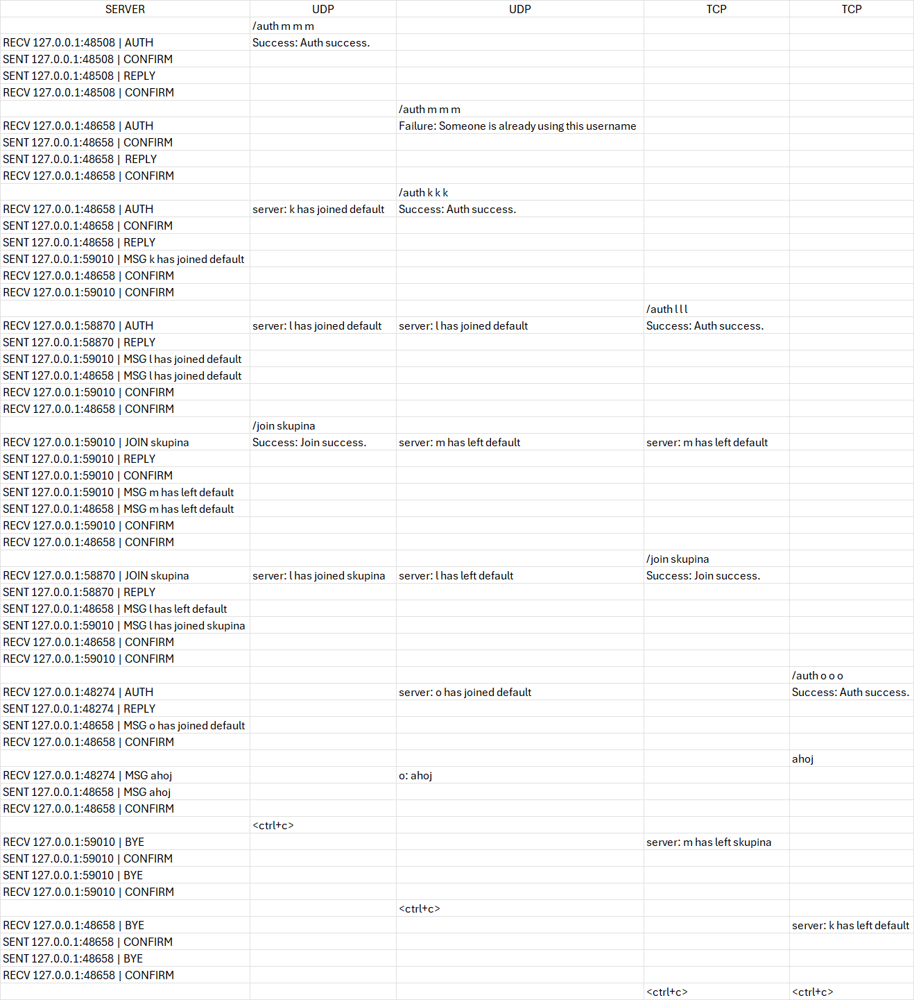

# Dokumentace

## Struktura

1. [Úvod](#uvod)
2. [Použití](#pouziti)
3. [Struktura Kodu](#struktura)
4. [Testování](#testovani)
5. [Bibliografie](bibliografie)

## 1. Úvod

- IPK projekt č. 2, zadání IOTU je navazující na projekt č. 1 [<a name="3" href="#IPK-projekt_1">3</a>].
- Transmission Control Protocol (TCP) je spojovaný, spolehlivý protokol navržený pro přenos dat v modelu klient-server. TCP poskytuje rozsáhlé funkce pro zajištění spolehlivého a řízeného přenosu dat.
- User Datagram Protocol (UDP) je nespojovaný, nespolehlivý protokol navržený pro rychlý přenos dat v síťových aplikacích, které nevyžadují spolehlivost. [<a name="1" href="#Project1">1</a>]
- Jde o Klientský server, který je schopný spojit klienty, kteří se připojí pomocí udp nebo tcp protokolu a umožnit komunikaci mezi těmito klienty.

- **Součástí je soubor `users.csv`, kde je potřeba napsat "registrované" uživatele ve formátu `username,secret,displayname`!**

## 2. Použití

1. **instalace:**
- stažení repozitáře, uvnitř zadat make, to vytvoří spustitelný soubor. Pro vymazání binárních souboru make clean.

2. **Spuštění:**
- ./ipk24chat-server -l serverAddress -p port -d timer -r retries
- `-l serverAddress`: IP adresa nebo název serveru - (výchozí: 0.0.0.0)
- `-p port`: port - (uint16, výchozí: 4567)
- `-d timer`: timer - (uint16, výchozí: 250~ms) - čas, po kterém se zpráva znovu odešle UDP klientovi.
- `-r retries`: retries - (uint8, výchozí: 3) - počet znovuodeslání zprávy UDP klientovi.
- `-h`: help - vypíše pomocnou zprávu pro spuštění serveru a nastavení parametrů podle potřeby.

- Po spuštění se na `stdout` vypíše: 
    `TCP server listening on port 4567 on IP address 0.0.0.0`
    `UDP server listening on port 4567 on IP address 0.0.0.0`
    Port a adresa se pochopitelně vypíše podle nastavené hodnoty.
## 3. Hlavní struktura

Po zapnutí serveru a případného nastavení parametrů se vytvoří UDP a TCP sockety. TCP socket je nastaven s možností `SO_REUSEADDR` pro znovupoužití adresy a portu, a oba sockety jsou vázány na stejnou adresu a port. Poté se nastaví 2 výchozí `poll()` na 2 vytvořené sockety (TCP, UDP). Hlavní cyklus se odehrává ve while, kde se čte ze socketu pomocí `poll()`, UDP klient skočí vždycky do funkce `handleUDP()`, v této funkci se zkontroluje, jestli je klient už byl připojený a nebo je nový a podle toho se vytvoří objekt klienta a pointer na klienta je uložen v `vector<ClientBase*> clients`, pokud není nový, volá se funkce `handleUDPClient`. TCP klient pokud je nový, jeho socket je tedy `tcpServerSock`, skočí do funkce `handleNewTCPClient()`. V této funkci se vytvoří objekt klienta a pointer na klienta je uložen v `vector<ClientBase*> clients` a jeho socket je uložen do pole `fds`, které se použivá pro poll. Toto pole je potom v hlavním while pomocí for cyklu čteno pro vytvořené tcp klienty, kde se volá funkce `handleTCPClient`.

Server jako svůj výstup na `stdout` vypisuje informace o přijatých zprávách/příkazech a reakce na ně ve formátu: `RECV {FROM_IP}:{FROM_PORT} | {MESSAGE_TYPE}[MESSAGE_CONTENTS]` a `SENT {TO_IP}:{TO_PORT} | {MESSAGE_TYPE}[MESSAGE_CONTENTS]`[<a name="2" href="#Project2">2</a>], příklad: `RECV 127.0.0.1:59870 | AUTH` a `SENT 127.0.0.1:59870 | REPLY`. U zprávy typu `MSG` vypisuje zároveň obsah dané zprávy, např: `SENT 127.0.0.1:36071 | MSG k has joined default` a u `JOIN` vypisuje zárověň i skupinu, ke které se chce daný klient připojit: např: `RECV 127.0.0.1:36071 | JOIN sk`. 

**Diagramy autorizace, přidání do skupiny a přijetí zprávy** 
[<a name="2" href="#Project2">2</a>]

  

 

**Struktura main**

  

**Struktura handleUDPClient**

  

**Struktura handleTCPClient**

  

    

## 4. Testování

- K testování byl použitý vytvořený klient v projektu č. 1 [<a name="3" href="#IPK-projekt_1">3</a>]. Testování probíhalo zapnutím serveru a postupným připojováním několika klientů. Bylo připojeno několik UDP klientů a několik TCP klientů. Ti postupně zkoušeli `/auth` s neplatnými přihlašovacími údaji a poté s platnými údaji ale když už dané `username` někdo jiný používá. Zkoušel jsem `/join`, `/rename` a poté `/join`, kde program rozpoznal klienta, jenom s jiným `username`. Program vypisuje všem klientům, kromě daného `{DisplayName} has left {ChannelID}` nebo `{DisplayName} has joined {ChannelID}` [<a name="2" href="#Project2">2</a>]. Bylo testováno, zda program korektně odpovídá UDP klientům zprávou `CONFIRM` po přijetí zprávy a zda po odpojení Klienta ruší jeho objekt a znovuzpřístupní jeho přihlašovací údaje pro opětovné připojení (UDP i TCP).

**Příklad testování:**

  

## 5. Bibliografie

[<a href="#1">1</a>] [Project1] Dolejška, D. Client for a chat server using IPK24-CHAT protocol [online]. February 2024. [cited 2024-04-22]. Available at: https://git.fit.vutbr.cz/NESFIT/IPK-Projects-2024/src/branch/master/Project%201

[<a href="#2">2</a>] [Project2] Dolejška, D. Chat server using IPK24-CHAT protocol [online]. February 2024. [cited 2024-04-22]. Available at: https://git.fit.vutbr.cz/NESFIT/IPK-Projects-2024/src/branch/master/Project%202/iota

[<a href="#3">3</a>] [IPK-projekt_1] xbabus01 Client for a chat server using IPK24-CHAT protocol [online]. April 2024. [cited 2024-04-22]. Available at: https://git.fit.vutbr.cz/xbabus01/IPK-projekt_1
