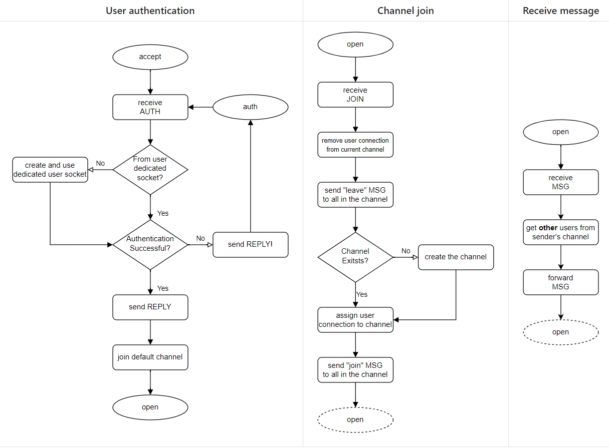
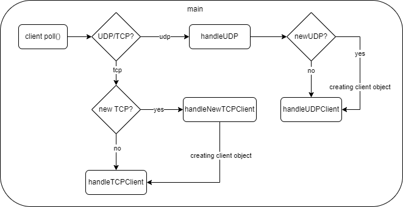
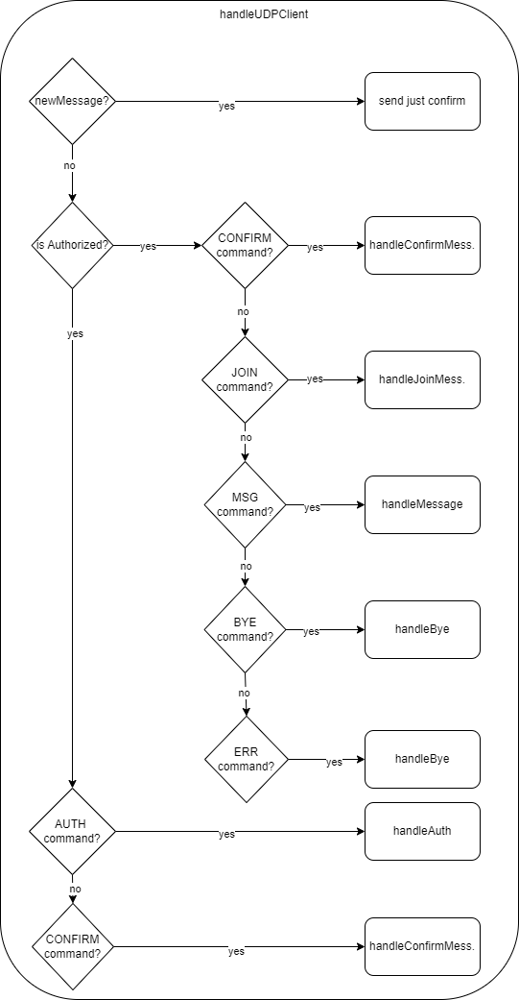
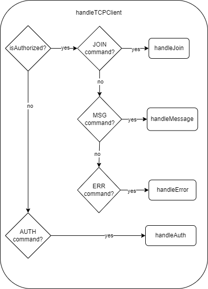

# Dokumentace

## Struktura

1. [Úvod](#uvod)
2. [Použití](#pouziti)
3. [Struktura Kodu](#struktura)
4. [Testování](#testovani)
5. [Bibliografie](bibliografie)

## 1. Úvod

- IPK projekt č. 2, zadání IOTU je navazující na projekt č. 1 \[3\].
- Jde o Klientský server, který je schopný spojit klienty, kteří se připojí pomocí udp nebo tcp protokolu a umožnit komunikaci mezi těmito klienty.

## 2. Použití

1. **instalace:**
- stažení repozitáře, uvnitř zadat make, to vytvoří spustitelný soubor. Pro vymazání binárních souboru make clean.

2. **Spuštění:**
- ./ipk24chat-server -l serverAddress -p port -d timer -r retries
- `-l serverAddress`: IP adresa nebo název serveru - (výchozí: 0.0.0.0)
- `-p port`: port - (uint16, výchozí: 4567)
- `-d timer`: timer - (uint16, výchozí: 250~ms) - čas, po kterém se zpráva znovu odešle UDP klientovi.
- `-r retries`: retries - (uint8, výchozí: 3) - počet znovuodeslání zprávy UDP klientovi.
- `-h`: help - vypíše pomocnou zprávu pro spuštění serveru a nastavení parametrů podle potřeby.

## 3. Hlavní struktura

Po zapnutí serveru a případného nastavení parametrů se vytvoří UDP a TCP sockety. TCP socket je nastaven s možností `SO_REUSEADDR` pro znovupoužití adresy a portu, a oba sockety jsou vázány na stejnou adresu a port. Poté se nastaví 2 výchozí `poll()` na 2 vytvořené sockety (TCP, UDP). Hlavní cyklus se odehrává ve while, kde se čte ze socketu pomocí `poll()`, UDP klient skočí vždycky do funkce `handleUDP()`, v této funkci se zkontroluje, jestli je klient už byl připojený a nebo je nový a podle toho se vytvoří objekt klienta a pointer na klienta je uložen v `vector<ClientBase*> clients`, pokud není nový, volá se funkce `handleUDPClient`. TCP klient pokud je nový, jeho socket je tedy `tcpServerSock`, skočí do funkce `handleNewTCPClient()`. V této funkci se vytvoří objekt klienta a pointer na klienta je uložen v `vector<ClientBase*> clients` a jeho socket je uložen do pole `fds`, které se použivá pro poll. Toto pole je potom v hlavním while pomocí for cyklu čteno pro vytvořené tcp klienty, kde se volá funkce `handleTCPClient`.

**Diagramy autorizace, přidání do skupiny a přijetí zprávy** 
\[2\]

  

 

**Struktura main**

  

**Struktura handleUDPClient**

  

**Struktura handleTCPClient**

  

    

## Testování

- K testování byl použitý vytvořený klient v projektu č. 1 [\[3\]]. Pro ověření byly použiti klienti z projektu spolubydlicího, kteří nechtěl být jmenován.

## Bibliografie

## Bibliografie

[1][Project1] Dolejška, D. Client for a chat server using IPK24-CHAT protocol [online]. February 2024.  
[cited 2024-04-22]. Available at: https://git.fit.vutbr.cz/NESFIT/IPK-Projects-2024/src/branch/master/Project%201

[2][Project2] Dolejška, D. Chat server using IPK24-CHAT protocol [online]. February 2024.  
[cited 2024-04-22]. Available at: https://git.fit.vutbr.cz/NESFIT/IPK-Projects-2024/src/branch/master/Project%202/iota

[3][IPK-projekt_1] xbabus01 Client for a chat server using IPK24-CHAT protocol [online]. April 2024.  
[cited 2024-04-22]. Available at: https://git.fit.vutbr.cz/xbabus01/IPK-projekt_1
